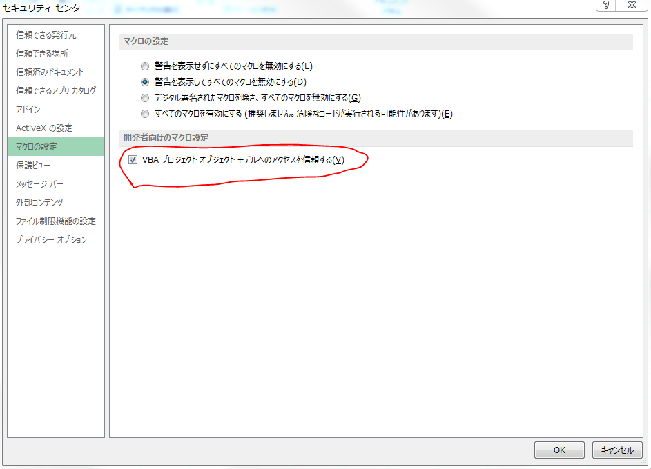

# VBA-PSCreater

## What's this?
It is a tool that automatically  generates the design documents from the code of VBA .
It can be used as an Excel add-in.

## How to install
```bash
double click 「Install.vbs」
```
Open Excel and Check Option



## Requirement

* Windows7
* Excell2010
